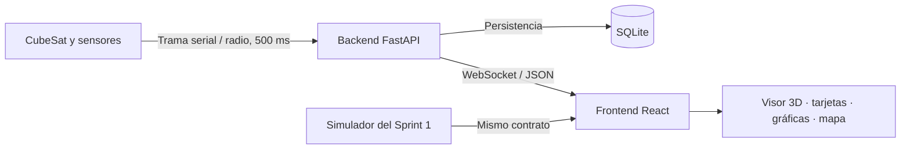
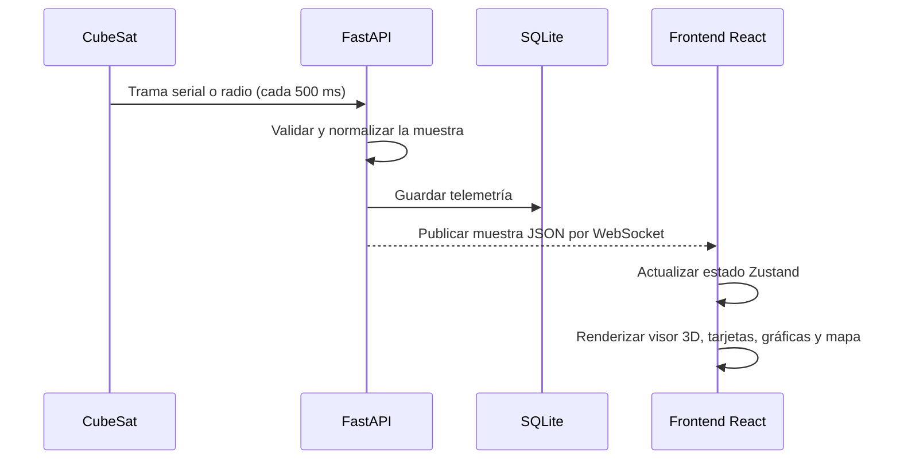

# Arquitectura del sistema

## Vista general

La solución se organiza en tres capas: hardware, backend y frontend. En el Sprint 1 el frontend sustituye temporalmente al hardware y backend con datos simulados; el diseño debe conservar la misma interfaz de datos para que la transición al Sprint 2 no obligue a rehacer la UI.

## Capas y responsabilidades

| Capa | Componentes | Responsabilidad | Estado |
| --- | --- | --- | --- |
| Hardware | Sensores del CubeSat | Producir la telemetría y enviarla por serial/radio. | Futuro |
| Backend | PySerial/radio, FastAPI, WebSocket, SQLAlchemy | Interpretar la trama, persistirla y publicarla al frontend. | Planificado para Sprint 2 |
| Frontend | React, Zustand, Three.js, Recharts, React-Leaflet | Consumir y representar el último dato y su historial. | Sprint 1 |

## Flujo de telemetría objetivo

## Restricciones de diseño

- El frontend no debe depender de la fuente de datos: simulador y WebSocket deben producir el mismo contrato.
- La cadencia objetivo es 2 Hz (una muestra cada 500 ms).
- SQLite se adopta para la etapa educativa; la capa ORM mantiene abierta la migración posterior a PostgreSQL.
- El detalle de campos, unidades y persistencia está en [telemetría y sensores](telemetria-y-sensores.md).

## Decisiones relacionadas

- [ADR-001 — Stack frontend](../ADR/ADR-001-stack-frontend.md)
- [ADR-002 — Base de datos](../ADR/ADR-002-base-de-datos.md)
