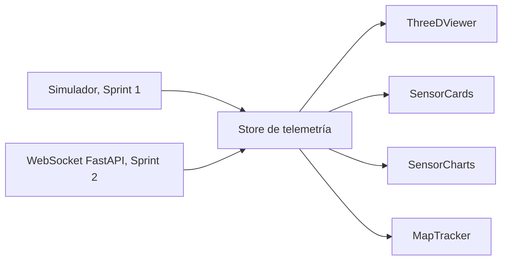

# Especificación de frontend

## Objetivo de la interfaz

Presentar telemetría del CubeSat de forma comprensible, visual y educativa. El frontend consume una muestra de datos cada 500 ms, procedente del simulador en el Sprint 1 y del WebSocket del backend en el Sprint 2.

La elección de React + Vite y las bibliotecas base está registrada en [ADR-001](../ADR/ADR-001-stack-frontend.md). El contrato que alimenta los componentes está en [telemetría y sensores](../Arquitectura/telemetria-y-sensores.md).

## Layout de referencia

```text
┌──────────────────────────────────────────────────────────────┐
│ Header: CHASQUI-II · timestamp · estado de conexión          │
├─────────────────────────┬────────────────────────────────────┤
│ Visor 3D                │ Tarjetas de sensores               │
│                          │ Gráficas en tiempo real            │
├─────────────────────────┴────────────────────────────────────┤
│ Mapa GPS: posición y trayectoria orbital                     │
└──────────────────────────────────────────────────────────────┘
```

En móvil, las secciones **3D**, **Sensores** y **Mapa** se presentan como pestañas verticales. Los wireframes disponibles se encuentran en [la referencia visual](README.md).

## Componentes

| Componente | Tecnología | Datos | Comportamiento requerido |
| --- | --- | --- | --- |
| `ThreeDViewer` | Three.js + React Three Fiber + Drei | `gyro_roll`, `gyro_pitch`, `gyro_yaw` | Modelo 1U (10×10×10 cm), ejes XYZ, controles orbitales y HUD numérico. |
| `SensorCards` | React | Última muestra | Muestra temperatura, UV, humedad, altitud, orientación y aceleración; usa estado visual normal/alerta/crítico. |
| `SensorCharts` | Recharts | Últimos 60 puntos | Gráficas de temperatura, orientación y aceleración durante los últimos 30 s. |
| `MapTracker` | React-Leaflet + OpenStreetMap | `gps_lat`, `gps_lon`, `gps_alt` | Marcador actual, popup con coordenadas y polilínea de las últimas 100 posiciones. |

## Estado de telemetría

El store global debe separar la última muestra del historial de visualización:

```ts
type TelemetryState = {
  latest: TelemetrySample | null;
  history: TelemetrySample[]; // máximo 60 muestras para gráficas
  connection: "simulated" | "connecting" | "connected" | "disconnected" | "error";
};
```

La transición desde el simulador al WebSocket no debe cambiar la forma de `TelemetrySample`. La fuente de datos se inyecta o intercambia en el borde de la aplicación, no dentro de cada componente visual.

## Flujo de renderizado



## Pendientes antes de implementar

- Definir los umbrales que convierten cada tarjeta en normal, alerta o crítico.
- Confirmar la semántica de roll, pitch y yaw para la rotación 3D.
- Especificar las pantallas adicionales presentes en wireframes (construcción, configuración y expansiones).
- Acordar el protocolo WebSocket: URL, mensaje de conexión, validación y manejo de desconexiones.
