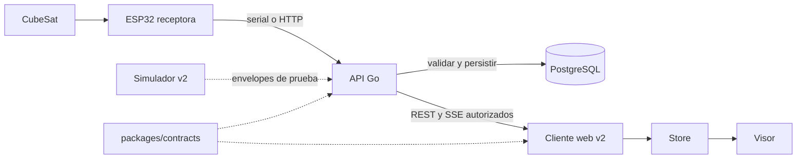

# Arquitectura del sistema

Estado 2026-10-01: web, UI compartida, contratos hardware v2 y simulador de
reproducción implementados. PR3 añade API Go local con identidad/dispositivos
persistidos en PostgreSQL; ingestión, SSE y autenticación pública siguen pendientes.
[ADR 0005](adr/0005-backend-local-cloud-media.md),
[diseño objetivo](superpowers/specs/2026-10-01-cubeos-backend-design.md),
[modelo de dominio](domain-model.md) y
[plan por PRs](superpowers/plans/2026-10-01-cubeos-backend.md) gobiernan esa entrega.
FastAPI/SQLite/WebSocket son antecedentes sustituidos.

## Bordes actuales

| Capa | Ubicación | Responsabilidad |
| --- | --- | --- |
| Frontend | `apps/web` | Rutas Next.js, widgets y store Zustand |
| UI compartida | `packages/ui` | Primitivas y tokens, sin negocio de sensores |
| Demo de frontend | `packages/telemetry`, fuente en web | Muestra legacy sintética e historial breve |
| Contrato hardware | `packages/contracts` | Esquemas JSON, tipos y fixtures compartidos TS/Go |
| Reproducción | `tools/simulator` | Envelopes v1 deterministas NDJSON o fixtures con tiempo lógico |
| API local | `apps/api` | Health/readiness, identidad persistente y CRUD de dispositivos con propiedad |
| Instalación local | `infra/docker` | Contenedores sin root, PostgreSQL persistente y red sin egress |

Web todavía usa `TelemetrySource`/`simulatorSource`: el hook inicia y detiene la
fuente, el store mantiene `latest`, hasta 60 entradas de `history` y `connection`.
Los widgets no consumen directamente timers ni sockets. No se cambia la apariencia
ni el paquete legacy en PR2/PR3. La adopción de v2 por web corresponde al PR7.

pnpm coordina workspaces `apps/*`, `packages/*`, `tools/*`, con un lockfile raíz.
Turbo coordina lint/typecheck/build/test; tareas de test dependen de las de sus
paquetes productores. Los inputs por defecto incluyen esquemas, fuentes y fixtures:
cambiar contratos invalida consumidores. Desarrollo no se cachea. CI añade el job
`contracts`, `go-postgres` y `docker-local` al agregador `ci-required`, que exige éxito de todos y falla
también ante un job omitido/cancelado.

Los puertos de persistencia pertenecen a sus consumidores: HTTP consume
`DeviceStore`, y PostgreSQL aplica propiedad en cada consulta. No existe todavía
`PacketRepository`: su consumidor entra en PR4. Operación, límites, entorno y
comandos de migración tienen su fuente en [API local](../apps/api/README.md).

## Flujo objetivo pendiente

Ambos adaptadores de recepción invocarán el mismo procesamiento. Payload compacto
intacto, metadatos externos y fuente/tiempo del servidor: [contrato y unidades](telemetry.md).
LoRa pertenece a la cadena de hardware documental; CubeOS no implementa un
receptor LoRa. NDJSON serial es una propuesta de framing pendiente con el firmware.

Una PostgreSQL por instalación conservará identidad, dispositivos, pasos,
progreso, tramas, snapshots y metadatos de fotos. Los archivos irán a almacenamiento
local persistente o S3; fotos y telemetría tienen transporte independiente.
Local y pública no se sincronizan. Perfil local sin Internet tras preparar
dependencias; Clerk en público, sin fallback de autenticación.

El snapshot será una proyección de últimas lecturas válidas por grupo, con
revisión y frescura fuera del objeto legible. REST/SSE comprobarán propiedad.
Nada de este flujo se presenta todavía como endpoint operativo.
