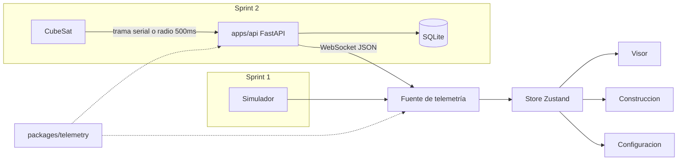
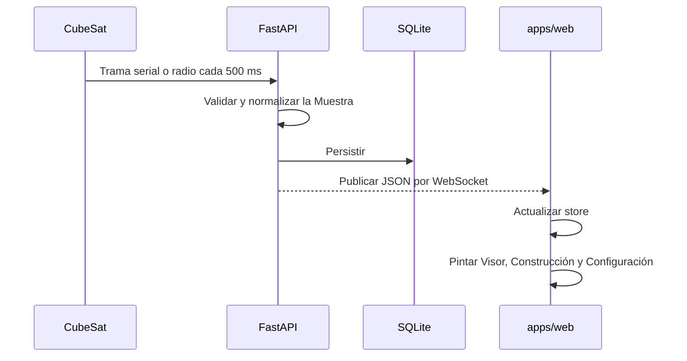

# Arquitectura del sistema

Estado de este documento: antecedente de la vista previa implementada. La arquitectura objetivo vigente es [Go, PostgreSQL, offline y fotografías](superpowers/specs/2026-10-01-cubeos-backend-design.md), según [ADR 0005](adr/0005-backend-local-cloud-media.md). Su [modelo de dominio](domain-model.md) y [plan de PRs](superpowers/plans/2026-10-01-cubeos-backend.md) definen la migración. Las referencias FastAPI/SQLite/WebSocket siguientes describen el plan anterior, no el backend que se construirá.

La solución tiene tres capas: hardware, backend y frontend. En el Sprint 1 el frontend sustituye hardware y backend con el Simulador. La UI no cambia de contrato al pasar al Sprint 2.

## Capas

| Capa | Dónde | Responsabilidad | Estado |
| --- | --- | --- | --- |
| Hardware | CubeSat | Producir la trama. | Futuro |
| Backend | `apps/api` | Interpretar, persistir y publicar Muestras. | Sprint 2 |
| Contrato | `packages/telemetry` | Tipo `Muestra`, unidades y validación. | Tipo implementado; validación pendiente |
| Frontend | `apps/web` (Next.js) | Consumir y representar última Muestra e historial. | Sprint 1 |

Forma del repo: [docs/adr/0003-monorepo-multipaquete.md](adr/0003-monorepo-multipaquete.md). Campos: [docs/telemetry.md](telemetry.md).

## Puerto de telemetría

Un único puerto en el borde de `apps/web`. El Simulador y el WebSocket futuro implementan el mismo contrato. Ningún widget habla con el timer ni con el socket.

En Sprint 1, `TelemetrySource` define ese borde y `simulatorSource` lo implementa. El hook de React inicia y detiene la fuente; el store Zustand conserva la última Muestra, el historial y la Conexión para que el shell y el Visor lean el mismo estado.

El store guarda:

- `latest`: última Muestra o `null`
- `history`: hasta 60 Muestras (~30 s) para gráficas
- `connection`: `simulated` \| `connecting` \| `connected` \| `disconnected` \| `error`

En Sprint 1 el Simulador ocupa el lugar de HW + API.

## Restricciones

- Cadencia objetivo: 2 Hz.
- SQLite es para la etapa educativa; el ORM deja abierta la migración a PostgreSQL.
- Composición estática del Visor aprobada antes de Three.js / WebGL.
- `apps/web` es Next.js; el Visor en vivo es Client Component. Sin Route Handlers de telemetría.
- `apps/api` no se crea en el Sprint 1.
