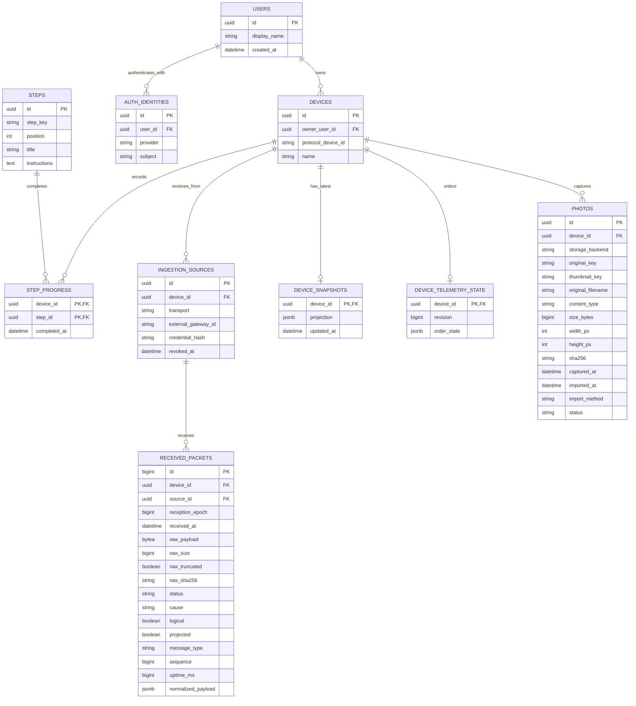

# Modelo de dominio de CubeOS

Estado: propuesta para revisión, 2026-10-01. Diseño técnico: [arquitectura](superpowers/specs/2026-10-01-cubeos-backend-design.md). Entregas: [plan por PRs](superpowers/plans/2026-10-01-cubeos-backend.md).

Una base PostgreSQL por instalación contiene identidad, construcción, telemetría y metadatos de fotografías. Los originales y miniaturas viven en almacenamiento local persistente o compatible con S3. Local y pública son instalaciones independientes, sin sincronización automática. Las fotografías tienen un transporte independiente de la telemetría entregada por la ESP32 receptora.

## Reglas de relación y persistencia

- Un estudiante registra sus CubeSats directamente y les pone un nombre visible, modificable. Cada dispositivo tiene un propietario. No hay proyectos de construcción, versiones de guía ni sesiones de armado.
- Una identidad es única por `(provider, subject)`. El proveedor local representa un perfil persistido; Clerk representa una identidad pública. El correo no es la clave de propiedad.
- Un dispositivo se identifica internamente por UUID. `CS01` no es globalmente único: varios estudiantes pueden usarlo. El nombre visible no modifica el identificador enviado por el hardware; la fuente autenticada determina el dispositivo permitido.
- Cada fuente pertenece a un dispositivo. `serial` y `http` son transportes, no propietarios. Las credenciales de ingestión son distintas de las sesiones de estudiantes y solo se almacenan como hashes.
- La secuencia `n` no basta para identificar tramas a través de reinicios o desbordamientos. El procesamiento conserva un contador interno de periodos de recepción (`reception_epoch`), sin entidad de sesión. Registra discontinuidades y evita que una trama atrasada sustituya datos más nuevos; no atribuye automáticamente todo descenso de `u` a un reinicio.
- Las tramas inválidas también se registran. Sus campos interpretados pueden ser nulos. Se imponen límites de tamaño antes de almacenarlas.
- Las retransmisiones pueden conservarse como recepciones distintas, pero no vuelven a actualizar el snapshot ni se cuentan como muestras nuevas. La identidad lógica válida incluye dispositivo, periodo de recepción, tipo y secuencia; contenidos distintos bajo esa identidad se registran como conflicto.
- El snapshot es una proyección reconstruible de tramas válidas; se modifica de forma atómica por dispositivo. Tiene antigüedad y secuencia por grupo. El tiempo UTC del dispositivo no sustituye al tiempo de recepción.
- `STEPS` es una lista común y ordenada de pasos de ensamblaje. Cada paso tiene identificador estable, título e instrucciones; el identificador no cambia al reordenarlo. No se inventa contenido educativo.
- El progreso es único por `(device_id, step_id)`: indica qué pasos completó el propietario al armar ese CubeSat. Marcar/desmarcar es idempotente; el porcentaje se calcula a partir de los pasos, no se almacena como otra fuente de verdad. Reordenar pasos conserva el progreso y añadir uno aumenta el total.

## Una base, responsabilidades separadas

Una fotografía pertenece a un dispositivo. El original se conserva byte a byte; las miniaturas son derivados. `captured_at` puede ser nulo si no se conoce la fecha; `imported_at` lo asigna el servidor. Se guardan claves de objetos, no URLs firmadas temporales. Wi-Fi, importación de archivos recuperados por USB y una futura recepción serial convergen en el mismo registro de fotos; `cameraOk` no prueba que se haya recibido un archivo.

Las migraciones separan tablas de identidad/construcción, fotografías y telemetría dentro de la misma base. Índices iniciales: dispositivo y recepción; fuente y recepción; proveedor y subject; propietario de dispositivo; fotografías por dispositivo y captura/importación. Tramas válidas y originales se conservan por defecto, sin purga automática; la retención futura exige configuración explícita. El historial no está limitado a las 60 muestras del frontend. No hace falta Redis, un broker ni una segunda base para el volumen inicial.

Clerk mantiene sus propios datos de autenticación como proveedor externo; eso no implica crear una segunda base de aplicación. El modo local usa exclusivamente la base local. Conservar progreso al reiniciar requiere un volumen persistente de PostgreSQL.
