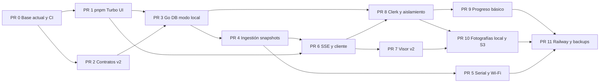

# Plan de implementación de CubeOS por PRs

> **For agentic workers:** REQUIRED SUB-SKILL: Use superpowers:executing-plans for inline implementation. Steps use checkbox syntax for tracking. Este plan propone ejecución nativa secuencial; no solicita crear subagentes.

**Goal:** Entregar un monorepo con contratos Chasqui v2, backend Go, recepción desde ESP32 por serial/HTTP, realtime, historial analizable, fotografías local/S3 y modo local verificable, manteniendo el frontend.

**Architecture:** Una API modular y una PostgreSQL por instalación. Serial y Wi-Fi convergen en el mismo procesamiento. El frontend consume REST y SSE; la identidad puede ser local o Clerk.

**Tech Stack:** pnpm, Turborepo, Next.js/React, Go, PostgreSQL, SSE, Docker Compose, GitHub Actions; Clerk para la instalación pública.

**Spec:** [Diseño propuesto](../specs/2026-10-01-cubeos-backend-design.md). [Modelo de dominio](../../domain-model.md).

## Global Constraints

- Las ramas previstas usan `chore/`, `feat/` y `docs/`, sin `codex/`.
- Los commits usan la identidad Git del usuario y no añaden atribución a agentes ni trailers de coautoría IA.
- Una base PostgreSQL por instalación; local y pública no se sincronizan en esta etapa.
- El payload compacto se valida intacto contra el esquema entregado.
- El modo local no exige Clerk ni Internet después de preparar dependencias e imágenes.
- El frontend conserva apariencia y un modo demo; las lecturas reales muestran ausencia/falla/antigüedad.
- Sin telecomando, cálculos UV no calibrados, orientación inventada ni porcentaje de batería sin modelo aprobado.
- PRs progresivos: cada PR debe pasar checks en runners antes de integrarse. No se salta CI por haber pasado checks locales.
- No incorporar secretos, `.env`, datos de estudiantes ni capturas privadas al repo público.

## Review Focus

1. Reinicio, wrap de uint32, duplicado y recepción fuera de orden: conservar evidencia y no retroceder la última lectura.
2. Fuente autenticada que envía `id` ajeno y usuario que pide otro dispositivo: rechazo en REST, ingestión y stream.
3. GPS/batería ausentes, cero legítimo, UV sin calibración y velocidad angular: representación correcta sin reemplazos sintéticos.
4. Arranque local sin egress y reinicio de Compose: visor usable y progreso/telemetría persistentes.
5. Desconexión SSE, cliente lento y expiración de sesión: reconexión autorizada sin bloquear ingestión.

## Estado previo y reglas de integración

Inspección del 2026-10-01: rama `main`, sin remoto Git configurado, dos commits documentales y frontend/paquetes mayormente sin seguimiento. Hay modificaciones y eliminaciones documentales previas. No es una base limpia para abrir PRs directamente. No se mezclan las modificaciones existentes con el refactor a ciegas.

Antes de mover cambios: snapshot recuperable que incluya archivos no rastreados relevantes, excluyendo secretos y dependencias; inventario de lo incluido. `git stash create` por sí solo no protege archivos no rastreados. Usar snapshot gestionado o copia validada y luego stage de archivos explícitos. No usar `git add .`, reset, clean ni force-push. Confirmar remoto proporcionado por el usuario o descubierto mediante su repositorio; no inventar URL ni crear repositorio externo en esta fase.

La identidad actual es `Edwarmkaer <edwarfin24@gmail.com>`; verificarla antes del primer commit y conservarla. Cada PR se abre contra la rama principal después de integrar sus dependencias. Mantener PRs pequeños; no iniciar consumidores sobre interfaces que todavía no pasaron runners. No hay señales CODEOWNERS en el checkout inspeccionado; no se asignan revisores ficticios.

Los comandos nuevos descritos debajo se agregan en el PR que los introduce. Durante la ejecución, fijar versiones compatibles con el lockfile existente, sin elegir `latest` implícito. Para Go, declarar una versión estable explícita compatible con las dependencias elegidas y usarla igual en Docker, CI y desarrollo.

## PR 0 — Registrar la base existente y activar checks

Rama: `chore/project-baseline`. Entregable: el visor actual y la documentación existente quedan versionados y construibles; no hay refactor funcional. Si el inventario muestra dos slices documentales/frontend independientes, separarlos manteniendo CI ejecutable.

Archivos: raíz `package.json`, `pnpm-workspace.yaml`, `pnpm-lock.yaml`, `apps/web/**`, `packages/telemetry/**`, documentación y referencias auditadas; crear `.github/workflows/ci.yml`.

- [ ] Crear snapshot recuperable e inventariar archivos nuevos/modificados/eliminados y exclusiones.
- [ ] Resolver remoto y comprobar base principal remota; revisar qué eliminaciones documentales pertenecen a la migración previa.
- [ ] Registrar solo la base acordada mediante rutas explícitas; reconciliar lockfile anidado sin subir dependencias.
- [ ] Añadir CI Linux para instalación reproducible, lint, tipos y build. Agregador estable `ci-required` falla si falla cualquier job aplicable.
- [ ] Verificar `pnpm install --frozen-lockfile`, `pnpm lint`, `pnpm --filter web exec tsc --noEmit`, `pnpm --filter web build`.
- [ ] Abrir PR y comprobar resultado real en runners; habilitar required checks en GitHub cuando existan y se disponga de permisos.

## PR 1 — Workspace, Turborepo y UI compartida

Rama: `chore/monorepo-foundation`. Depende de PR 0.

Archivos: crear `turbo.json`, `packages/ui/package.json`, `packages/ui/src/index.ts`, `packages/ui/src/styles/tokens.css`; mover primitivas reales desde `apps/web/src/components/ui/`; modificar imports, `apps/web/src/app/globals.css`, configuración Next/Tailwind y scripts raíz. Configuraciones compartidas solo donde exista consumo real.

Interfaces: web importa `@cubeos/ui` y sus estilos; los componentes conservan sus props. Tokens tienen una sola fuente. `pnpm dev`, `pnpm build`, `pnpm lint`, `pnpm typecheck` coordinan Turbo.

- [ ] Inventariar primitivas/tokens y capturar vistas actuales para comparación.
- [ ] Extraer sin cambiar presentación ni mover componentes de telemetría al paquete UI.
- [ ] Configurar outputs e inputs de caché; desarrollo persistente sin caché.
- [ ] Verificar imports, build y comparación visual del visor/landing; CI ejecuta lint, typecheck y build con caché correctamente invalidada.
- [ ] Commit sugerido: `refactor: extract shared UI and configure workspace tasks`.

## PR 2 — Contratos Chasqui v2 y simulador reproducible

Rama: `feat/telemetry-v2-contracts`. Depende de PR 0; puede revisarse aparte de PR 1.

Archivos: `packages/contracts/schemas/uplink-v2.json`, `schemas/snapshot-v2.json`, `fixtures/chasqui-v2/*.json`, `src/index.ts`, `tests/uplink-v2.test.ts`, `tests/normalization-fixtures.test.ts`; `tools/simulator/src/index.ts`; procedencia de entrega. Modificar `docs/telemetry.md`, `docs/architecture.md`, `PRODUCT.md`, `CONTEXT.md`, ADRs y decisiones abiertas para distinguir contrato real v2 del simulador legacy.

Interfaces: exportar `UplinkV2`, `SnapshotV2`, `ReceivedEnvelopeV1`; fixtures de normalización son compartidos por tests TypeScript y Go. `ReceivedEnvelopeV1` lleva `payload` intacto y metadatos opcionales de receptor; la fuente autorizada y `receivedAt` los determina el servidor.

- [ ] Tests: todos los ejemplos entregados cumplen el esquema; versión 1, clave desconocida y campo obligatorio ausente son rechazados. Campo opcional ausente y valor cero válido se distinguen.
- [ ] Definir esquema legible compatible con el snapshot entregado y frescura como metadato separado; validar también el ejemplo de snapshot.
- [ ] Fixtures: E `t1=2465 → 24.65`, O `uvIndex=null`, I `gz=18 → 0.018 grados/s`, G `al=81240 → 812.4 m`; no producir Euler ni porcentaje.
- [ ] Simulador reproduce H/E/O/I y G opcional; escenarios deterministas de duplicado, desorden, reinicio y fallas, con seed. No necesita hardware.
- [ ] Verificar `pnpm --filter @cubeos/contracts test` y comando de reproducción documentado; jobs de contrato obligatorios en CI.
- [ ] Registrar nuevos ADRs como propuestas/aceptados según revisión, indicando expresamente cuáles decisiones anteriores sustituyen.

## PR 3 — API Go, PostgreSQL y modo local

Rama: `feat/api-local-foundation`. Depende de PR 1 y PR 2.

Archivos: `apps/api/go.mod`, `cmd/server/main.go`, `internal/config/`, `internal/storage/migrations/`, `internal/identity/`, `internal/devices/`, `internal/http/`; `infra/docker/Dockerfile.api`, `Dockerfile.web`, `compose.yaml`, ejemplos de entorno; wrapper de tareas API y jobs Go.

Interfaces: `GET /healthz`, `GET /readyz`; CRUD de dispositivos del usuario, con nombre visible modificable, `Principal{UserID}` y autorización por propietario. PostgreSQL implementa entidades del modelo; perfil local persistente. El puerto lógico `PacketRepository` pertenece al consumidor del dominio, no a un ORM genérico.

- [ ] Tests de configuración: modo público+auth local falla; Clerk caído no habilita perfil local. Loopback por defecto.
- [ ] Migraciones para usuarios/identidades/dispositivos/fuentes; usuario local idempotente. Tests contra PostgreSQL de servicio, incluyendo cambio de nombre que no altera el identificador de vuelo.
- [ ] Health separa proceso vivo de base disponible; migraciones se aplican con comando explícito y exclusión concurrente.
- [ ] Construir contenedores multi-stage no root, volúmenes persistentes y configuración por entorno. Fijar origen permitido y protección de escrituras locales.
- [ ] Verificar `go test ./...`, `go vet ./...`, formato limpio; `docker compose -f infra/docker/compose.yaml up --build -d` y smoke test. Repetir arranque sin Internet después de preparar imágenes/assets.
- [ ] Actualizar CI para Go e integración DB y Docker; paths excluidos no dejan `ci-required` eternamente pendiente.

## PR 4 — Ingestión, historial y snapshots

Rama: `feat/telemetry-ingestion`. Depende de PR 3.

Archivos: `apps/api/internal/ingestion/{validate,normalize,service}.go`, tests correspondientes; `internal/telemetry/{snapshot,ordering}.go`, tests; migraciones de tramas/snapshots y contador interno de periodos de recepción; consultas de historial.

Interfaces: `Ingest(ctx, sourceID, rawPayload, receiverMetadata) (IngestResult, error)`; `GetSnapshot(ctx, principal, deviceID)` y `ListPackets(ctx, principal, deviceID, cursor, limit)`. Resultado distingue aceptada, duplicada y rechazada; snapshot tiene revisión monotónica por dispositivo.

- [ ] Tests de conversiones compartidas del PR 2 y rechazo que conserva raw/cause sin actualizar snapshot.
- [ ] Tests de autenticación de fuente vs `id`, duplicados, conflicto con igual secuencia, desorden, discontinuidades y wrap; no confundir tramas de periodos de encendido distintos.
- [ ] Validar→normalizar→persistir→proyectar en transacción; serializar actualización por dispositivo. Paginación limitada y tramas válidas conservadas por defecto; ninguna purga implícita.
- [ ] Añadir filtros de historial por dispositivo/tipo/intervalo y exportación CSV por grupo con unidades explícitas. Tests cubren paginación sin duplicados/huecos, rangos de tiempo y rechazo de dispositivo ajeno; no rellenar campos de otros grupos.
- [ ] Frescura por grupo; paquete I no refresca E/G ni inventa lecturas GPS/energía. `fl` conserva eventos y errores.
- [ ] CI: tests con PostgreSQL y `go test -race ./...`; verificar reconstrucción del snapshot desde fixtures.

## PR 5 — Adaptadores serial y Wi-Fi

Rama: `feat/hardware-transports`. Depende de PR 4.

Archivos: `apps/api/internal/ingestion/serial.go`, `serial_test.go`, `http.go`, `http_test.go`; configuración serial y CLI simulator para HTTP/stream serial.

Interfaces: adaptador serial recibe `io.Reader` para pruebas y un puerto configurado en ejecución; ambos adaptadores llaman al mismo `Ingest`. `POST /api/v1/ingestion/packets` exige una credencial revocable ligada a fuente.

- [ ] Tests con reader de bytes: fragmentación, varias tramas por lectura, línea malformada, límite de tamaño, desconexión y reconexión. Baudrate se configura, no se fija sin evidencia.
- [ ] Tests HTTP: credencial inválida/revocada, dispositivo ajeno y metadatos RSSI/SNR fuera del uplink; ambos transportes producen el mismo snapshot.
- [ ] Añadir selección serial local sin servicio gateway independiente; documentar USB/UART y opción Docker con dispositivo explícito.
- [ ] CI usa reader/PTY cuando aplique y simulador HTTP; prueba con radio real queda como aceptación de campo, no se finge en runner.

## PR 6 — Realtime SSE y cliente tipado

Rama: `feat/telemetry-realtime`. Depende de PR 4 y PR 1.

Archivos: `apps/api/internal/realtime/{hub,sse}.go`, tests; `packages/api-client/src/{client,stream}.ts`, tests; OpenAPI en contracts.

Interfaces: `GET /api/v1/devices/{id}/events`, evento `snapshot` con `{revision,snapshot,freshnessByGroup}`. Cliente `subscribeTelemetry(deviceId, {getToken,onSnapshot,onConnection,signal})` procesa SSE usando fetch con autenticación y cancelación.

- [ ] Tests: aislamiento por propietario, chunk partido y multiline SSE, reconnect que obtiene último snapshot, cancelación y deduplicación por revisión.
- [ ] Colas limitadas, heartbeat, timeout y expiración de sesión; cliente lento no bloquea el ingreso de otro dispositivo.
- [ ] Documentar que `Last-Event-ID` no promete replay completo; REST proporciona historial.
- [ ] CI: integración ingestión→DB→SSE y pruebas parser TypeScript; race detector Go.

## PR 7 — Conectar el visor al contrato real

Rama: `feat/visor-live-telemetry`. Depende de PR 6; PR 5 habilita pruebas de transportes.

Archivos: `apps/web/src/lib/telemetry-{source,store}.ts`, `use-telemetry.ts`, simulator; componentes de visor y configuración; tests de integración web.

Interfaces: selección explícita demo/local/API pública. Store mantiene snapshot y frescura; su inicio real es pendiente, no una muestra demo. Adaptador demo sigue disponible separado.

- [ ] Tests de GPS ausente y fix inválido, cero legítimo, UV sin calibrar y batería pendiente; mapa espera coordenadas.
- [ ] Mostrar velocidad angular como tal; visualización de actitud queda pendiente si no existe estimador aprobado. Mantener estilo de gráficas sin falsificar semántica.
- [ ] Separar conexión frontend→API y receptor→CubeSat; dejar Paneles y Cámara reales pendientes conforme al payload.
- [ ] Retirar paquete legacy únicamente cuando no queden consumidores; preservar capturas visuales de referencia.
- [ ] CI browser integra API/simulador y confirma datos visibles; modo local sin egress no depende de mapa remoto/fuentes remotas.

## PR 8 — Identidad pública y permisos

Rama: `feat/google-auth`. Depende de PR 3 y PR 6.

Archivos: configuración Clerk en web; `apps/api/internal/identity/clerk.go`, tests; autorización REST/SSE y ciclo de credenciales de fuentes.

Interfaces: subject Clerk→usuario interno, sin usar correo como FK. Google es proveedor configurado por el propietario. Identidad local permanece válida solo en despliegue local.

- [ ] Tests JWT con claves de fixture: expiración, issuer/audience configurados, firma inválida y sujeto desconocido; sin credenciales reales en CI.
- [ ] Tests usuario A/B para dispositivos, snapshots, historia, suscripciones y revocación de fuente. La protección de rutas Next no sustituye la de Go.
- [ ] Configurar integración sin crear cuentas externas automáticamente; documentar variables y pasos Google/Clerk de producción.
- [ ] Verificar interfaz local sin SDK online obligatorio y pública con cuenta de prueba autorizada; runners usan fixture/mock aislado, nunca identidad bypass de producción.

## PR 9 — Guardar progreso de Construcción

Rama: `feat/construction-progress`. Depende de PR 8; la persistencia local usa identidad del PR 3.

Archivos: `apps/api/internal/construction/`, migraciones de `steps` y `step_progress`; API client; integración mínima en Construcción.

Interfaces: `GET /api/v1/steps`; `GET /api/v1/devices/{id}/progress`; `PUT /api/v1/devices/{id}/steps/{stepId}` con `{completed:boolean}`. Validar existencia del paso y propiedad del dispositivo.

- [ ] Tests con pasos fixture: marcar dos veces no duplica, desmarcar funciona, paso inexistente se rechaza, usuario ajeno no accede. Dos CubeSats conservan progreso independiente; reordenar pasos mantiene el completado por ID.
- [ ] Guardar y recuperar progreso tras reiniciar API/DB con volumen; porcentaje derivado y fechas coherentes.
- [ ] Integrar guardado mínimo sin construir ahora el simulador de ensamblaje ni inventar un catálogo para alumnos.
- [ ] Si no hay guía real, entregar backend y estado de preparación; publicar pasos solo cuando se proporcione contenido educativo.

## PR 10 — Fotografías originales, galería y almacenamiento local/S3

Rama: `feat/photo-storage`. Depende de PR 7 y PR 8; soporte local del PR 3.

Archivos: `apps/api/internal/media/{service,http,thumbnail}.go`, tests, `internal/media/storage/{store,local,s3}.go`, tests; migración `photos`; cliente API, galería web y configuración Compose.

Interfaces: `ObjectStore.Put(ctx, key, reader, contentType)`, `Open(ctx, key)`, `Delete(ctx, key)`; adaptadores implementan el mismo contrato de almacenamiento. `POST /api/v1/devices/{id}/photos` multipart, `GET /api/v1/devices/{id}/photos` paginado, `GET /api/v1/photos/{id}/original` y `/thumbnail`, todos autorizados. El endpoint de descarga puede servir local o redirigir a URL S3 firmada corta. No requiere modificar uplink v2.

- [ ] Tests de contrato compartidos para filesystem temporal y servidor S3 de CI; límites 64 MiB/80 MP configurables, JPEG/PNG iniciales y rechazo de firma/MIME incoherentes.
- [ ] Guardar bytes originales y SHA-256, generar miniaturas por separado; fechas de captura ausentes permanecen nulas. Probar upload cortado, retry, caída storage/DB y reconciliación de estado pendiente.
- [ ] Importación manual de archivos recuperados vía USB y carga HTTP autenticada desde Pi/ESP32. Documentar futuro UART binario sin implementarlo hasta recibir framing.
- [ ] Probar aislamiento A/B y credenciales de medios; telemetría no autoriza fotos implícitamente. URLs temporales no se guardan en tablas ni exponen objetos ajenos.
- [ ] Configurar `MEDIA_STORAGE=local|s3`; endpoint/bucket/region por entorno. Tests locales sin egress, persistencia tras reinicio y S3 con bucket privado.
- [ ] Galería usa miniaturas y paginación, permite descargar original, conserva aspecto aprobado; demo se diferencia de fotografías reales. CDN queda opcional y respeta visibilidad.
- [ ] CI obligatorio para medios con PostgreSQL y servidor S3 de pruebas aislado, sin credenciales de Railway/R2.

## PR 11 — Preparación de Railway y restauración

Rama: `chore/railway-deployment`. Depende de PR 5, PR 9 y PR 10.

Archivos: `infra/railway/`, documentación de variables/despliegue; scripts de backup/restore y workflow de imágenes si no existe. No crear ni desplegar recursos cloud sin encargo de ejecución del propietario.

- [x] Configurar servicios web/API, `PORT`, checks readiness, PostgreSQL y variables de S3/Clerk. Subida a R2 o Railway Buckets por configuración; no usar disco efímero para originales.
- [x] Documentar secrets por entorno, URL API/orígenes, SSE a través del proxy, límites de upload y costes salientes del proveedor.
- [x] Probar backup/restauración en instalación descartable: DB y objetos mantienen fotos/propiedad/progreso e historial. Nunca usar DB de producción para tests de restauración.
- [x] Workflow de build/publicación con tags y SHA en ramas confiables; jobs de PR verifican imágenes y configuración sin desplegar ni recibir secretos.
- [ ] Despliegue real y smoke test público solo cuando estén configuradas cuentas y destino; registrar resultados reales, no confundir validación CI con despliegue confirmado.

## Puerta de cada PR y publicación

1. Tests significativos fallan antes del cambio de comportamiento y pasan después; cambios visuales/reversibles usan verificación adecuada en lugar de tests espejo.
2. Revisión del diff con archivos explícitos; comparar contra spec y fixtures.
3. Checks locales correspondientes; commit del usuario sin atribución IA.
4. Push y PR contra la base integrada correcta; esperar checks reales y corregir fallos.
5. Handoff con URL, alcance, checks y limitaciones. No fusionar por defecto sin autorización del usuario.

CI inicial basta para calidad; publicar imágenes en GHCR se añade como workflow independiente una vez configurado remoto. Disparadores de publicación solo para tags/releases o rama confiable, con versión y SHA. Sin despliegue cloud implícito.

## Revisión del plan

El alcance cubre UI compartida, Go, una DB, offline, recepción ESP32 por serial/Wi-Fi, payloads v2, realtime, historial/exportación, fotografías locales/S3, auth, progreso básico y preparación Railway. Ningún PR presume hardware adquirido. Quedan fuera sincronización local/cloud, firmware, transporte UART binario de fotografías, estimación de actitud, porcentaje batería y simulador de ensamblaje; necesitan especificaciones separadas.

La creación del remoto/PR 0 requiere resolver dónde publicar este checkout. El resto puede desarrollarse y verificarse localmente, pero no se afirma validación por runners hasta tener una ejecución GitHub real.
